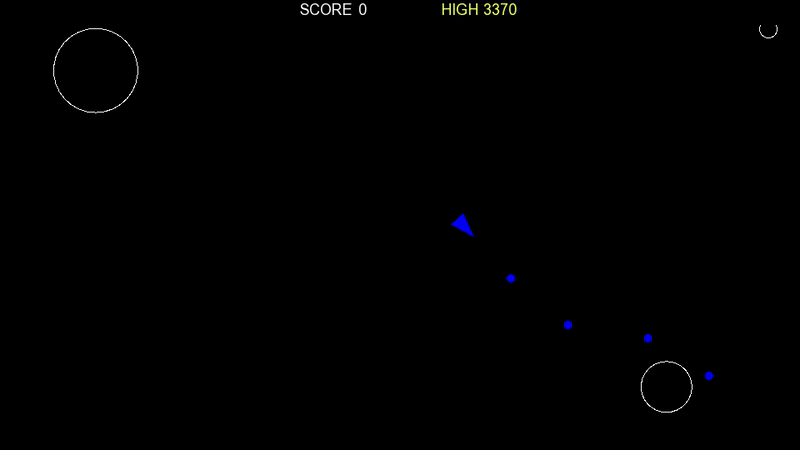

# AsteroidsCpp

Classic Asteroids made in C++ with SFML. 

This is project 4 in a series of 10 projects I am making in C++. Along the way I am developing a framework/library of my own called BrightLib. 

BrightLib updates for this project:
- Adding an entity class to share some code between the entities in the game. Keeping it simple and incrementing the complexity of the game and lib with every project.

### Projects in the series:
1. [Breakout](https://github.com/carreraSilvio/BreakoutCpp)
2. [Pong](https://github.com/carreraSilvio/PongCpp)
3. [Snake](https://github.com/carreraSilvio/SnakeCpp)
4. [Asteroids](https://github.com/carreraSilvio/AsteroidsCpp)
5. [Space Invaders](https://github.com/carreraSilvio/SpaceInvadersCpp)
6. [Bomberman](https://github.com/carreraSilvio/BombermanCpp)
7. [Pac-man](https://github.com/carreraSilvio/PacmanCpp)
8. [Frogger](https://github.com/carreraSilvio/FroggerCpp)
9. Donkey Kong
10. Xevious